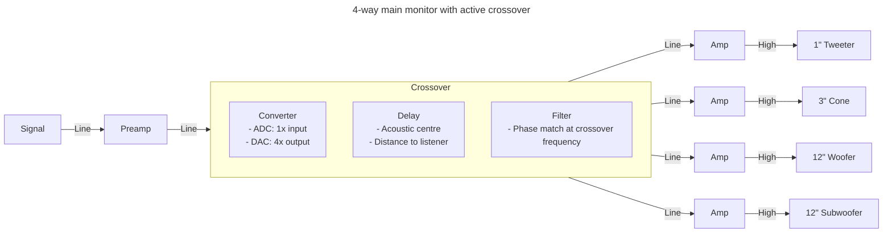

# From Scratch: Monitor Speakers

## Units

- [Decibel](https://www.sfu.ca/sonic-studio-webdav/handbook/Decibel.html)
- [SPL](https://sengpielaudio.com/calculator-soundlevel.htm)

## Software

- [BassBox Pro](https://www.ht-audio.com/pages/Products.html#BBxL)

## Amplifier

### Class A

- [Amp Camp Amp](https://diyaudiostore.com/pages/project-amp-camp-amp)

### Crossover

- [Lunch with Paul: everything you wanted to know about crossovers](https://www.youtube.com/watch?v=-9KU4kAFExg)

## Driver

### Thiele-Small

Thiele-Small (T/S) parameters are a set of electromechanical parameters that define the behavior of loudspeakers, particularly low-frequency drivers such as woofers. Named after A. Neville Thiele and Richard H. Small, who developed and popularized these parameters, they provide a standardized way to describe the key characteristics of a speaker's performance, especially in relation to its enclosure design.

- **fs** (Resonance Frequency): This is the frequency at which the speaker's cone naturally resonates. It is a crucial parameter for understanding how the speaker will perform at low frequencies.
- **Qts** (Total Q Factor): This parameter represents the overall damping of the speaker, combining both mechanical (Qms) and electrical (Qes) damping. It is a dimensionless parameter that indicates how underdamped (high Q) or overdamped (low Q) the speaker is.
- **Qms** (Mechanical Q Factor): This is the mechanical damping of the speaker, relating to the physical characteristics such as the suspension and surround.
- **Qes** (Electrical Q Factor): This represents the electrical damping of the speaker, which is influenced by factors like the voice coil resistance and the magnet system.
- **Vas** (Equivalent Compliance Volume): This parameter is related to the stiffness of the speaker’s suspension and gives an equivalent volume of air that would have the same compliance as the speaker’s suspension.
- **Re** (DC Resistance): This is the DC resistance of the speaker's voice coil and is important for determining how much power the speaker will draw from an amplifier.
- **Sd** (Effective Piston Area): The effective area of the speaker cone that moves air. It’s usually expressed in square meters.
- **Xmax** (Maximum Linear Excursion): This is the maximum distance the speaker cone can move in one direction without distortion.
- **Mms** (Total Moving Mass): The total mass of the speaker’s moving parts, including the cone, voice coil, and any air load.
- **Cms** (Compliance of the Suspension): This describes how compliant (flexible) the speaker’s suspension is.
- **Bl** (Force Factor): This parameter represents the strength of the motor structure (magnet and voice coil) in terms of the force it produces in the magnetic field.

#### Resources

- [Measuring Thiele/Small parameters](https://sbacoustics.com/wp-content/uploads/2021/01/Measuring-Thiele-Small-parameters.pdf)
- [Wikipedia: Thiele-Small](https://en.wikipedia.org/wiki/Thiele/Small_parameters)

### Tweeter

- [Lunch with Paul: all about tweeters](https://www.youtube.com/watch?v=_AJgl_c0O7I)

### Subwoofer

- [Axiom Audio - Multiple Subwoofers with Ian Colquhoun](https://www.youtube.com/watch?v=ayOXz26qm3I)
- [Supravox](https://www.supravox.fr/en)

### Passive Radiator

- [How to Design, build and Tune a Passive Radiator](https://www.youtube.com/watch?v=S_cTXISfQJQ)
- [Lunch with Paul: Passive Radiators](https://www.youtube.com/watch?v=IUv6kp33E9A)
- [Sealed vs Ported vs Passive Radiator - Why one over the other? - Sound Advice](https://www.youtube.com/watch?v=-gIN7QjRuGE)

## Example

3-way mainfield with subwoofer

### Speaker

- 3-way
  - Dome tweeter
  - Midrange
  - 12/15 inch woofer sealed

### Subwoofer

- 12/15 inch woofer
- 12/15 inch passive raditor

### Crossover

- Digital
  - Mono input
  - 4-way out

### Amplifier

- 4-way Class D

