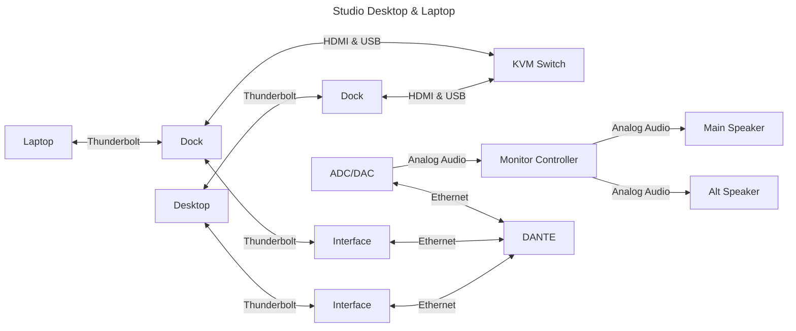

# From Scratch: Music Studio

## Location

## Building

## Sound Isolation

## Acoustics

### Psychoacoustics

## Monitor Speakers

### Brands

- [Augspurger](https://augspurger.com)
- [ATC](https://atc.audio/professional)
- [Hot House](https://www.hothousepro.com)
- [PMC](https://pmc-speakers.com/studio/main-monitors)
- [Symphonic Acoustics (George Augspurger)](https://symphonicacoustics.com/george-augspurger-studio-monitors)
- [Quested](https://quested.com)

### Calibration

- [ATSC A/85:2013](https://www.atsc.org/atsc-documents/a85-techniques-for-establishing-and-maintaining-audio-loudness-for-digital-television/)
- [C Weighting](https://librosa.org/doc/latest/generated/librosa.C_weighting.html)
- [Dolby: At what level should I calibrate my speakers? At what level should I mix?](https://professionalsupport.dolby.com/s/article/At-what-level-should-I-calibrate-my-speakers-At-what-level-should-I-mix?language=en_US)
- [Test signals (code)](http://soundexpert.org/test-signals)
- [audiocheck.net](https://www.audiocheck.net/index.php)

## Human Requirements

- Light
- HVAC

## Technical Requirements

### Signals

- Electricity
- Analog
  - **Low**: Microphone
  - **Mid**: Line
  - **High**: Amp to speaker
- Digital
  - Ethernet
    - Video
    - Audio
      - AVB
      - DANTE
