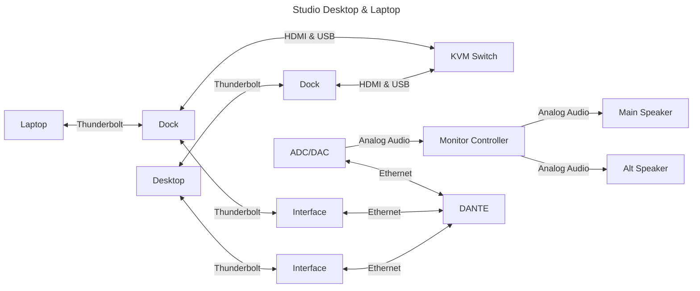

# From Scratch: Music Studio

## Location

## Building

## Sound Isolation

- [Sound Transmission](https://www.sekon.cc/acoustics/SoundTransmission/index.htm)
- [Equal Loudness](https://cdn.standards.iteh.ai/samples/83117/6afa5bd94e0e4f32812c28c3b0a7b8ac/ISO-226-2023.pdf)

## Acoustics

### Psychoacoustics

### Absorber

#### TubeTrap

- [ASC TubeTrap](https://www.acousticsciences.com/product/tubetrap-bass-trap)
  - [US Patent: 4548292](https://ppubs.uspto.gov/dirsearch-public/print/downloadBasicPdf/4548292?requestToken=eyJzdWIiOiIxNWQxODZmOS00OTU2LTQ3MjItOTgzYy0wNjI2Y2RhN2NjZDciLCJ2ZXIiOiJkNzU2ZWYzNC04ZDEyLTQ0NmQtYTAxMy02ZGY2ZmQzNjUyODciLCJleHAiOjB9)
- [Bluetone Acoustics Tube BassTrap](https://www.btacoustics.com/tube-basstrap)
- [HOFA BassTrap V2](https://hofa-akustik.de/en/modules/basstrap/)
  - <https://recording.de/threads/hofa-basstrap.257370/>
  - <https://gearspace.com/board/bass-traps-acoustic-panels-foam-etc/1400734-tube-traps-hofa-vs-t-akustik-vs-gik.html>
  - <https://i.pinimg.com/550x/3f/28/0e/3f280e2b69fb913a7ccefd499046d323.jpg>
- [GIK Acoustics Turbo Trap](https://gikacoustics.de/produkte/turbo-trap/)
- [t.akustik Tube Trap WH](https://www.thomann.de/de/t.akustik_tube_trap_wh.htm)
- **DIY:**
  - [Johns Manville Pipe Insulation (used by Eric Valentine)](https://www.jm.com/en/mechanical/pipe-insulation/)
  - [Stadur-Süd Dämmstoff-Produktions GmbH](https://stadur-sued.com/produkte/daemmstoffzuschnitte/rohrschalen/)
  - [Isover U Protect Pipe Section Alu2](https://www.isover-technische-isolierung.de/produkte/u-protect-pipe-section-alu2)
    - <https://www.isolier-fuchs.de/mineralwolle-rohrisolierung-isolierschale-60-mm?number=501640090.60-219>
  - [Rockwool 800](https://www.rockwool.com/de/produkte/produktuebersicht/rockwool-800/)
    - <https://isolierprofi.eu/rs800-219x50-mm-rockwool-rohrisolierung-alukaschiert--2651.html>
    - <https://www.isoliermarkt.de/search?search=Rockwool+800>
    - <https://daemmstoffshop.com/products/rohrisolierung-rockwool-rs800-steinwolle-alukaschiert-ab-89mm-meterware?variant=46490433978717>
  - <https://www.rohrisolierung-direkt.de/rohrisolierung-alukaschiert/?srsltid=AfmBOooFFrtWN_4YzX0A33m7QamsbvVXi3ohocOHBNNquSejM90AJ1Sj>
  - <https://www.manomano.de/p/maschendraht-maschendrahtzaun-volierendraht-kaninchendraht-drahtgitter-viereckgeflecht-gartenzaun-20m-drahtrolle-hoehe-100cm-maschenweite-12x12mm-galvanisiert-9525989>
  - **Lid:**
    - <https://www.cnc-holzwelt.de/>

## Monitor Speakers

### Brands

- [Augspurger](https://augspurger.com)
- [ATC](https://atc.audio/professional)
- [Hot House](https://www.hothousepro.com)
- [PMC](https://pmc-speakers.com/studio/main-monitors)
- [Symphonic Acoustics (George Augspurger)](https://symphonicacoustics.com/george-augspurger-studio-monitors)
- [Quested](https://quested.com)

### Calibration

- [ATSC A/85:2013](https://www.atsc.org/atsc-documents/a85-techniques-for-establishing-and-maintaining-audio-loudness-for-digital-television/)
- [C Weighting](https://librosa.org/doc/latest/generated/librosa.C_weighting.html)
- [Dolby: At what level should I calibrate my speakers? At what level should I mix?](https://professionalsupport.dolby.com/s/article/At-what-level-should-I-calibrate-my-speakers-At-what-level-should-I-mix?language=en_US)
- [Test signals (code)](http://soundexpert.org/test-signals)
- [audiocheck.net](https://www.audiocheck.net/index.php)

## Human Requirements

- Light
- HVAC

## Technical Requirements

### Signals

- Electricity
- Analog
  - **Low**: Microphone
  - **Mid**: Line
  - **High**: Amp to speaker
- Digital
  - Ethernet
    - Video
    - Audio
      - AVB
      - DANTE
