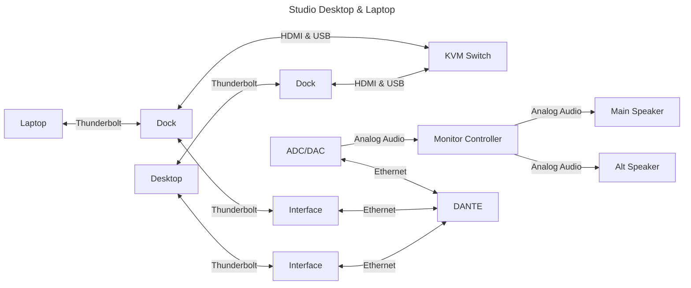

# From Scratch: Music Studio

## Location

## Building

## Sound Isolation

## Acoustics

### Psychoacoustics

## Monitor Speakers

- [ATC](https://atc.audio/professional)
- [Hot House](https://www.hothousepro.com)
- [Augspurger](https://augspurger.com)
- [PMC](https://pmc-speakers.com/studio/main-monitors)
- [Symphonic Acoustics (George Augspurger)](https://symphonicacoustics.com/george-augspurger-studio-monitors)
- [Quested](https://quested.com)

## Human Requirements

- Light
- HVAC

## Technical Requirements

### Signals

- Electricity
- Analog
  - **Low**: Microphone
  - **Mid**: Line
  - **High**: Amp to speaker
- Digital
  - Ethernet
    - Video
    - Audio
      - AVB
      - DANTE
